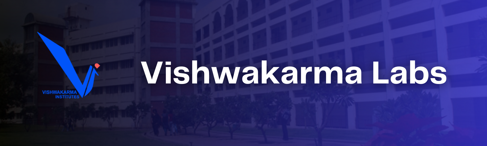
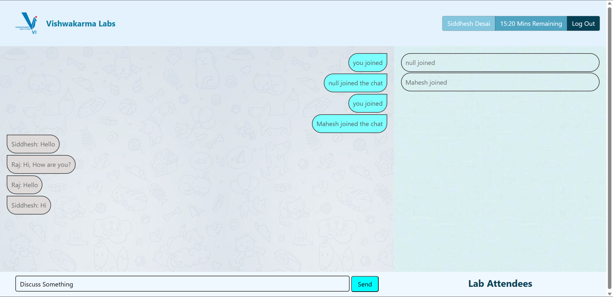

<a name="readme-top"></a>

[![Contributors][contributors-shield]][contributors-url]
[![Forks][forks-shield]][forks-url]
[![Stargazers][stars-shield]][stars-url]
[![Issues][issues-shield]][issues-url]
[![LinkedIn][linkedin-shield]][linkedin-url]

<!-- PROJECT LOGO -->
<br/>
<div align="center">
  <a href="https://github.com/siddhesh-desai/Vishwakarma-Labs">
    
  </a>
    <br>
    <br>

  <h3 align="center"><b>Vishwakarma Labs</b></h3>

  <p align="center">
    Vishwakarma Labs is an attendance management system designed for labs. With features like real-time chat, attendance tracking, and support for multiple participants, it makes managing lab sessions easy and efficient.
    <br />
    <br>
    <a href="https://github.com/siddhesh-desai/Vishwakarma-Labs"><strong>Explore the docs »</strong></a>
    <br />
    <a href="https://github.com/siddhesh-desai/Vishwakarma-Labs">View Demo</a>
    ·
    <a href="https://github.com/siddhesh-desai/Vishwakarma-Labs/issues">Report Bug</a>
    ·
    <a href="https://github.com/siddhesh-desai/Vishwakarma-Labs/issues">Request Feature</a>
  </p>
</div>

<!-- ABOUT THE PROJECT -->
<br>

## ♾️ About The Project

Vishwakarma Labs is an innovative web interface designed to streamline communication and attendance tracking within college laboratories. The project aims to enhance collaboration and interaction among students while providing a convenient and efficient method for marking attendance. The web interface of Vishwakarma Labs serves as a centralized platform where students can communicate with each other and share information related to their laboratory activities. It promotes a collaborative environment by facilitating discussions, resource sharing, and the exchange of ideas among students within the lab. Through this interface, students can easily connect and engage, fostering a sense of community and promoting effective learning.

One of the key features of Vishwakarma Labs is its attendance tracking system. The web interface provides a seamless mechanism for marking and managing attendance records. Students can log in to the system and mark their presence in the lab, eliminating the need for manual attendance sheets or traditional sign-in methods. This automated process ensures accuracy, reliability, and saves valuable time for both students and instructors. By implementing Vishwakarma Labs, colleges can simplify administrative tasks associated with attendance management. The system generates real-time attendance reports and provides insights into student participation and engagement. This data-driven approach enables instructors and lab administrators to monitor attendance trends, identify areas for improvement, and make informed decisions to enhance the learning experience.

Vishwakarma Labs is built using modern web technologies, ensuring a user-friendly and responsive interface. The web application leverages the power of HTML, CSS, and JavaScript to provide a seamless experience across different devices and browsers. The intuitive design and easy navigation contribute to a smooth user experience, allowing students and instructors to focus on their laboratory activities. With its emphasis on effective communication and attendance tracking, Vishwakarma Labs offers colleges a comprehensive solution for enhancing the laboratory experience. By promoting collaboration and ensuring accurate attendance records, the project aims to optimize the learning environment and facilitate better student outcomes in college laboratories.

<p align="right">(<a href="#readme-top">back to top</a>)</p>

## ⚙️ Built With

The technologies and tools used are:

- [![HTML][html]][html-url]
- [![CSS][css]][css-url]
- [![Javscript][js]][js-url]
- [![Socket.io][Socket]][Socket-url]

<p align="right">(<a href="#readme-top">back to top</a>)</p>

<!-- GETTING STARTED -->

## 🧑‍💻 Getting Started

Follow the below steps to set up the project locally:

### Installation

1. Clone the repository

   ```sh
   git clone https://github.com/siddhesh-desai/Vishwakarma-Labs.git
   ```

2. Open the terminal in the folder Vishwakarma-Labs and run the following:

   ```sh
   npm i
   ```

3. Move to the nodeServer folder:

   ```sh
   cd nodeServer
   ```

4. Install the dependencies and run:

   ```sh
   npm i
   npm start
   ```

5. Open `http://127.0.0.1:5501/index.html` in your browser and get started. To experience chatting open the same in two tabs and get started!

<p align="right">(<a href="#readme-top">back to top</a>)</p>

## 💡 Features

<br>

- Realtime Chatroom
- File Sharing
- Timer Based Attendance
- Auto Updation of Attendance in CSV File
- Updates to systems from Server

<p align="right">(<a href="#readme-top">back to top</a>)</p>

<!-- ROADMAP -->

## 🛣️ Roadmap

- [x] Realtime Chatroom
- [ ] File Sharing
- [ ] Timer Based Attendance
- [ ] Auto Updation of Attendance in CSV File
- [] Updates to systems from Server

See the [open issues](https://github.com/siddhesh-desai/Vishwakarma-Labs/issues) for a full list of proposed features (and known issues).

<p align="right">(<a href="#readme-top">back to top</a>)</p>

<!-- CONTRIBUTING -->

## 👣 Contributing

Any contributions you make are **greatly appreciated**.

If you have a suggestion that would make this better, please fork the repo and create a pull request. You can also simply open an issue with the tag "enhancement".
Don't forget to give the project a star! Thanks again!

1. Fork the Project
2. Create your Feature Branch (`git checkout -b feature/AmazingFeature`)
3. Commit your Changes (`git commit -m 'Add some AmazingFeature'`)
4. Push to the Branch (`git push origin feature/AmazingFeature`)
5. Open a Pull Request

<p align="right">(<a href="#readme-top">back to top</a>)</p>

## 📸 Screenshots

<br>

<br>

<!-- CONTACT -->

## 📧 Contact

Siddhesh Desai - [@thesiddheshdesai](https://www.linkedin.com/in/thesiddheshdesai/) - siddheshdesai777@gmail.com

Project Link: [https://github.com/siddhesh-desai/Vishwakarma-Labs](https://github.com/siddhesh-desai/Vishwakarma-Labs)

<p align="right">(<a href="#readme-top">back to top</a>)</p>

## ✨ Contributors

Thanks go to these wonderful people:

- [Siddhesh Desai](https://github.com/siddhesh-desai/)

[contributors-shield]: https://img.shields.io/github/contributors/siddhesh-desai/Vishwakarma-Labs.svg?style=for-the-badge
[contributors-url]: https://github.com/siddhesh-desai/Vishwakarma-Labs/graphs/contributors
[forks-shield]: https://img.shields.io/github/forks/siddhesh-desai/Vishwakarma-Labs.svg?style=for-the-badge
[forks-url]: https://github.com/siddhesh-desai/Vishwakarma-Labs/network/members
[stars-shield]: https://img.shields.io/github/stars/siddhesh-desai/Vishwakarma-Labs.svg?style=for-the-badge
[stars-url]: https://github.com/siddhesh-desai/Vishwakarma-Labs/stargazers
[issues-shield]: https://img.shields.io/github/issues/siddhesh-desai/Vishwakarma-Labs.svg?style=for-the-badge
[issues-url]: https://github.com/siddhesh-desai/Vishwakarma-Labs/issues
[license-shield]: https://img.shields.io/github/license/siddhesh-desai/Vishwakarma-Labs.svg?style=for-the-badge
[license-url]: https://github.com/siddhesh-desai/Vishwakarma-Labs/blob/master/LICENSE.txt
[linkedin-shield]: https://img.shields.io/badge/-LinkedIn-black.svg?style=for-the-badge&logo=linkedin&colorB=555
[linkedin-url]: https://linkedin.com/in/thesiddheshdesai
[html]: https://img.shields.io/badge/HTML-20232A?style=for-the-badge&logo=html&logoColor=61DAFB
[html-url]: https://developer.mozilla.org/en-US/docs/Web/HTML
[css]: https://img.shields.io/badge/Css-000000?style=for-the-badge&logo=css&logoColor=white
[css-url]: https://developer.mozilla.org/en-US/docs/Web/CSS
[js]: https://img.shields.io/badge/Javscript-0769AD?style=for-the-badge&logo=javascript&logoColor=white
[js-url]: https://developer.mozilla.org/en-US/docs/Web/javascript
[Socket]: https://img.shields.io/badge/Socket.io-20232A?style=for-the-badge&logo=Socket.io&logoColor=61DAFB
[Socket-url]: https://socket.io/docs/v3
